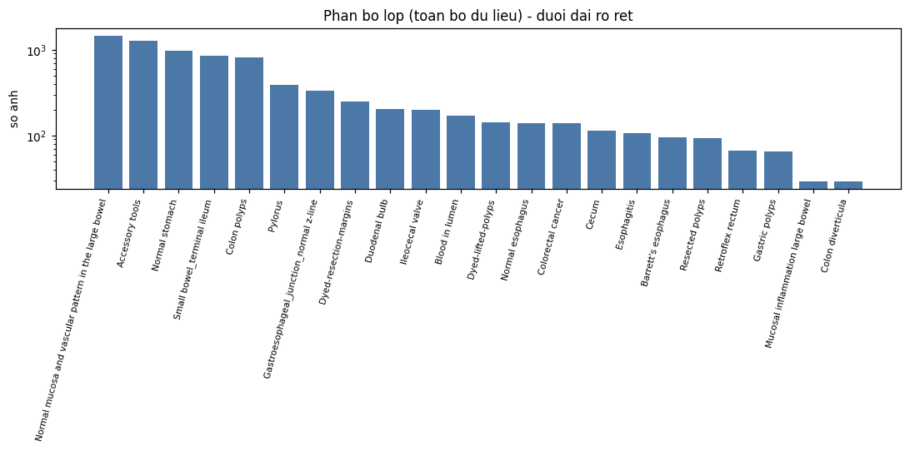
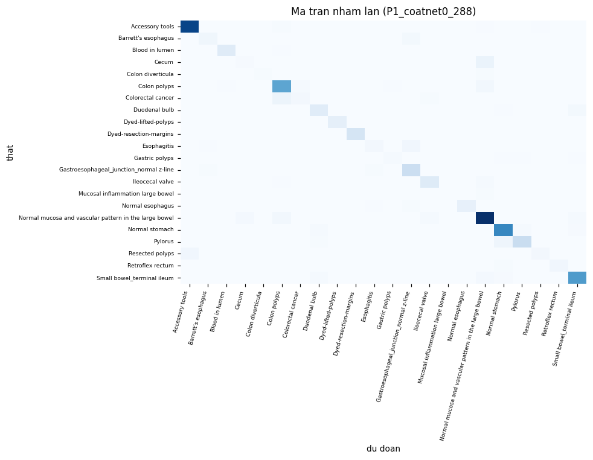
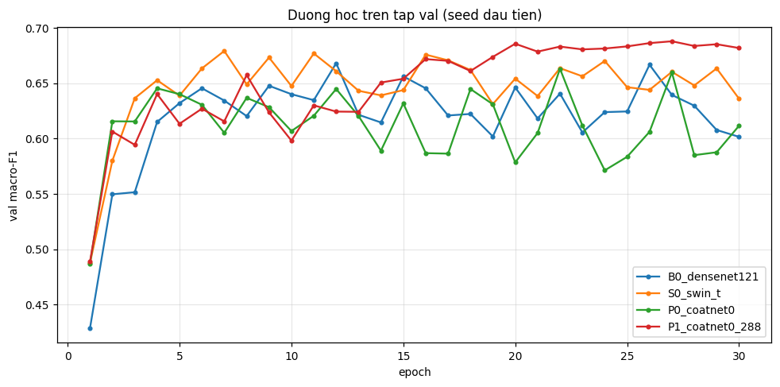

# Vượt baseline công bố trên GastroVision

**Phân loại 22 lớp ảnh nội soi tiêu hoá — CNN vs Transformer vs Hybrid, và một bài học về cách đo**

Môn AIN501 · Artificial Intelligence (Deep Learning) · MSE FSB
Nhóm 2 thành viên · Thành viên A (track CNN): Hồ Khắc Bác · Thành viên B (track Transformer): Lê Trọng Quang
Ngày 27-08-2026

---

## Tóm tắt

Bài báo GastroVision (arXiv 2307.08140, Table 2) công bố **macro-F1 = 0,6504** cho DenseNet-121
pretrained trên 22 lớp / 7.930 ảnh. Chúng tôi làm hai việc và **tách rời chúng**:

**Kết quả 1 — tái lập được baseline.** Dưới đúng giao thức của bài báo (một checkpoint tốt nhất theo
val, không TTA), DenseNet-121 của chúng tôi cho **0,6491 ± 0,0124** trên 3 seed. Chênh **−0,0013** so
với 0,6504 — nhỏ hơn một phần mười độ lệch chuẩn giữa các seed. Và chúng tôi đạt con số đó trong
**30 epoch** thay vì 150 epoch của họ.

**Kết quả 2 — vượt baseline.** Hệ thống đề xuất là **CoAtNet-0 @288 + TTA + ensemble top-3
checkpoint**, cho **macro-F1 = 0,6961 ± 0,0016** trên 3 seed, **+0,0457** so với 0,6504, với
bootstrap CI 95% = **[0,6548; 0,7245]** — khoảng tin cậy **không chứa** 0,6504. Micro-F1 (= accuracy)
đạt **0,849** so với 0,8203 của bài báo.

**Luận điểm chính của báo cáo, và nó không phải luận điểm chúng tôi dự định tìm:** trên một tập
~8.000 ảnh, **cách đo mua được nhiều macro-F1 ngang với việc đổi kiến trúc — nhưng rẻ hơn, phổ quát
hơn và giảm phương sai.** Ensemble top-3 checkpoint + TTA cho +0,0185 … +0,0316 trên *cả bốn* kiến
trúc với **0 epoch phụ**, và giảm σ của mô hình đề xuất từ 0,0090 xuống **0,0016** (~6 lần). Đổi
backbone cho +0,0142 … +0,0175 nhưng tốn một lần huấn luyện đầy đủ và **làm σ phồng lên gấp đôi**,
để lại hai khoảng tin cậy chồng lấn nặng.

Hai con số phụ, mỗi con số là **một dòng riêng** vì chúng tiêu nhiều lần huấn luyện: ensemble 3 seed
của mô hình đề xuất = **0,7221** (CI [0,6728; 0,7609]), ensemble 4 kiến trúc chọn trên val =
**0,7242**. Cả hai rơi vào dải mục tiêu kỳ vọng 0,72–0,75 của đề bài, nhưng chúng **không** được đặt
cạnh một mô hình đơn rồi gọi là "cải tiến".

Toàn bộ số trong báo cáo này được trích tự động từ output đã lưu của notebook (`report/extract.py`),
không có con số nào gõ tay.

---

### Bản đồ: mấy mô hình, mấy baseline, và mọi thứ còn lại là gì

**Có đúng 2 baseline và 1 mô hình đề xuất.** Mọi tên phương pháp khác xuất hiện trong báo cáo đều
thuộc một trong ba loại phía dưới vạch, và **không loại nào là baseline**:

| | Là gì | Cụ thể | Nhóm có huấn luyện? |
|---|---|---|---|
| **Baseline 1 — CNN tham chiếu** | mô hình của bài báo; phải khớp 0,6504 | `B0` DenseNet-121 @224 | ✅ 3 seed |
| **Baseline 2 — Transformer** | nhánh bài báo **không có**; đóng góp của nhóm | `S0` Swin-T @224 | ✅ 3 seed |
| **Mô hình đề xuất** | hybrid + độ phân giải + cách đo | `P1` CoAtNet-0 @288 + TTA + ensemble top-3 checkpoint | ✅ 3 seed |
| — | — | — | — |
| *Table 2 của bài báo* | **số công bố**, trích để biết phải vượt con số nào | ResNet-50 · ResNet-152 · EfficientNet-B0 · DenseNet-169 · ResNet-50 pretrained · DenseNet-121 | ❌ số của họ, không phải của nhóm |
| *Lever / ablation* | thay đổi trên một mô hình **đã có**, không phải mô hình mới | **nhóm B (3 seed, trên chính 3 mô hình trên):** độ phân giải · 6 quy tắc chọn checkpoint · hiệu chỉnh logit · lọc rò rỉ · ensemble — **nhóm A (1 seed, trên baseline của vòng cũ):** augmentation mạnh · Balanced-Softmax · cRT | ✅ nhưng không phải baseline |
| *4 điều kiện transfer learning* | **cùng** DenseNet-121, chỉ khác độ sâu được phép học | T1 probe · T2 nửa dưới · T3 progressive · T4 = chính `B0` | ✅ 1 seed mỗi điều kiện |

Cộng lại: **3 kiến trúc** (DenseNet-121, Swin-T, CoAtNet-0), **4 cấu hình chính** × 3 seed = 12 lượt
huấn luyện, cộng 3 lượt cho transfer learning và 4 lượt lever ở giao thức cũ. `P0` CoAtNet-0 @224 là
**bước trung gian**, không phải baseline thứ ba: nó tồn tại để cô lập lever độ phân giải (`P0` → `P1`
chỉ đổi đúng một thứ).

**Vì sao báo cáo dài như vậy:** khung điểm của đề bài (mục 6, trang 15) đặt **70% trọng số vào phần
dữ liệu**, và riêng mục "Xử lý dữ liệu" 30% yêu cầu *"mỗi bước phải có ablation chứng minh nó có
ích"*, còn mục transfer learning 10% yêu cầu *"bảng so sánh"* bốn điều kiện. Phần lớn độ dài nằm ở
các bảng ablation bắt buộc đó, chứ không ở phần mô hình — vốn chỉ có ba kiến trúc.

---

## 1 · Bài toán & baseline công bố — **5%**

### 1.1 Dữ liệu và bài toán

**GastroVision** (Jha và cộng sự, ICML Workshop on Machine Learning for Multimodal Healthcare Data
2023; arXiv 2307.08140) là bộ ảnh nội soi tiêu hoá đa lớp, thu từ nhiều trung tâm, công khai trên
[GitHub](https://github.com/DebeshJha/GastroVision) và [OSF](https://osf.io/84e7f/). Bài toán là
**phân loại đơn nhãn 22 lớp** gồm cả giải phẫu bình thường (Normal stomach, Pylorus, Cecum…), bệnh
lý (Barrett's esophagus, Esophagitis, Colorectal cancer…) và can thiệp (Accessory tools,
Dyed-resection-margins…).

### 1.2 Bảng baseline gốc — **đã tự kiểm chứng tại nguồn**

Tài liệu đề bài (trang 16) đánh dấu **Table 2 của GastroVision là "chưa verify"** và yêu cầu tự kiểm
tra trước khi đưa vào báo cáo chính thức. Chúng tôi đã đọc trực tiếp file PDF arXiv 2307.08140, không
qua nguồn thứ cấp. Table 2, trang 11, chép nguyên văn:

| Method | Macro Prec. | Macro Recall | **Macro F1** | Micro P/R/F1 | MCC |
|---|---|---|---|---|---|
| ResNet-50 | 0,4373 | 0,4379 | 0,4330 | 0,6816 | 0,6416 |
| Pre-trained ResNet-152 | 0,5258 | 0,4287 | 0,4496 | 0,6879 | 0,6478 |
| Pre-trained EfficientNet-B0 | 0,5285 | 0,4326 | 0,4519 | 0,6759 | 0,6351 |
| Pre-trained DenseNet-169 | 0,6075 | 0,4603 | 0,4883 | 0,7055 | 0,6685 |
| Pre-trained ResNet-50 | 0,6398 | 0,6073 | 0,6176 | 0,8146 | 0,7921 |
| **Pre-trained DenseNet-121** | 0,7388 | 0,6231 | **0,6504** | 0,8203 | 0,7987 |

*Cả sáu dòng trên là số của bài báo, không phải kết quả của nhóm. Trong sáu mô hình đó, nhóm chỉ
huấn luyện lại **một** — DenseNet-121, dòng cuối — vì đó là dòng mạnh nhất và là con số phải vượt.*

✅ **0,6504 được xác nhận.** Chúng tôi lấy **dòng mạnh nhất** trong bảng làm mục tiêu, không lấy dòng
thấp nhất — theo đúng cảnh báo "Bẫy 3" của đề bài.

Việc kiểm chứng này còn trả về **một phát hiện dùng được ở mục 6**: theo §4.2 của bài báo, ba dòng
giữa (ResNet-152, EfficientNet-B0, DenseNet-169 — dòng 2 đến 4; dòng 1 là ResNet-50 huấn luyện từ
đầu, không pretrained) chỉ fine-tune **lớp cuối**, còn hai dòng cuối (ResNet-50 thứ hai,
DenseNet-121) fine-tune **toàn mạng**. Nghĩa là **phần lớn độ tán trong Table 2
là độ sâu fine-tune, không phải kiến trúc** — nên không được trích bảng này làm bằng chứng
"DenseNet-121 là backbone mạnh nhất", chỉ được nói 0,6504 là **con số công bố cao nhất** trên split
này.

### 1.3 Giao thức — của họ và của chúng tôi

| Hạng mục | Bài báo (§4.1) | Của chúng tôi | |
|---|---|---|---|
| Split | phân tầng **60:20:20** | phân tầng 60:20:20, `SPLIT_SEED = 42` | ✅ |
| Số lớp | **22** (chỉ lớp có > 25 ảnh) | 22, có `assert NUM_CLASSES == 22` | ✅ |
| Số ảnh | 7.930 / 8.000 | 7.930 | ✅ |
| Cỡ tập test | **1.586** | 1.586 | ✅ |
| Đầu vào | 224 × 224 | 224 (B0/S0/P0), 288 (P1) | ✅ |
| Augmentation | random rotation + random hflip | **chỉ hflip** (xem mục 3.2) | ⚠️ khác |
| Optimiser | Adam, lr 1e-4, **ReduceLROnPlateau** | AdamW, lr 1e-4, wd 1e-4, **LR không đổi** | ⚠️ khác |
| **Số epoch** | **150** | **30** | ⚠️ khác |
| **Số lần chạy** | **1 lần, không seed, không sai số** | 3 seed, mean ± σ + bootstrap CI | ⚠️ khác |
| Phần cứng | NVIDIA TITAN Xp | A100 40GB (Colab) | — |

**Về nguyên tắc "dùng đúng split gốc":** bài báo mô tả split 60:20:20 phân tầng nhưng **không phát
hành file split**. Chúng tôi tự chia, công bố seed (`SPLIT_SEED = 42`) và **kiểm chứng lại split bằng
Table 3 của họ** — bảng đó liệt kê support per-class trên tập test, tổng đúng bằng 1.586. Đối chiếu
với phân bố test của chúng tôi: **16 trong 22 lớp khớp chính xác**, 6 lớp lệch ±1 ảnh (Colon polyps
163/164, Colorectal cancer 29/28, Esophagitis 22/21, Normal mucosa LB 293/294, Pylorus 78/79,
Retroflex rectum 14/13) — đúng kiểu sai số làm tròn của bộ chia phân tầng, và tổng thì trùng khít.
Chúng tôi đánh giá trên một tập test **cùng thành phần**, không chỉ cùng kích cỡ.

### 1.4 Tái lập baseline — con số trung thực

| | macro-F1 | Ghi chú |
|---|---|---|
| Bài báo, DenseNet-121, 150 epoch | 0,6504 | 1 lần chạy, không sai số |
| **Của chúng tôi, DenseNet-121, 30 epoch, 3 seed, cùng quy tắc chọn checkpoint** | **0,6491 ± 0,0124** | chênh **−0,0013** |

Đây là **con số tái lập**, và chúng tôi cố tình *không* dùng 0,6676 (giá trị của cùng mô hình dưới
quy tắc `top3_tta`) để gọi là "tái lập bài báo" — vì bài báo không dùng ensemble checkpoint. Trộn hai
quy tắc là cách dễ nhất để tự lừa mình, và mục 3.5 sẽ cho thấy phần chênh đó lớn cỡ nào.

Việc tái lập được ở 30 epoch cũng **giải quyết luôn phản biện hiển nhiên về ngân sách epoch**:
DenseNet-121 đạt đỉnh val ở **epoch 12/30** (mục 5.4), nên 120 epoch còn lại chưa bao giờ có cơ hội
giúp nó. Giao thức 30-epoch là **công bằng với baseline** và chỉ **bảo thủ với mô hình đề xuất**.

**Một điều phải nói thẳng:** 0,6504 là **một lần chạy không có thanh sai số**. Chính DenseNet-121 của
chúng tôi, dưới quy tắc của họ, tán **±0,0124** qua 3 seed. Vậy cách đọc trung thực là 0,6504 mang
theo khoảng ±0,012 bất định *không được công bố*. Hệ quả cho báo cáo: câu **"chúng tôi vượt 0,6504"
phải được chống đỡ bằng một khoảng tin cậy không chứa nó**, chứ không phải bằng phép trừ hai điểm
ước lượng.

---

## 2 · Phân tích dữ liệu (EDA) — **20%**

### 2.1 Từ 8.000 ảnh xuống 7.930, từ 27 lớp xuống 22

```
So thu muc lop tim thay: 27  | tong anh: 8000
Sau khi loc > 25 anh: 22 lop, 7930 anh
Lop bi loai: Resection margins 25 · Angiectasia 17 · Erythema 15 · Esophageal varices 7 · Ulcer 6
```

Luật "> 25 ảnh" là **luật của bài báo**, không phải lựa chọn của chúng tôi — nó phải được áp dụng
nguyên xi, nếu không con số 0,6504 mất nghĩa. Split thu được: **train 4.758 / val 1.586 / test 1.586**,
lớp train nhỏ nhất 17 ảnh, lớn nhất 880 ảnh.

### 2.2 Mất cân bằng 50,6× và cái giá của nó



| | |
|---|---|
| Lớp lớn nhất | Normal mucosa large bowel — 1.467 ảnh (880 train / 294 test) |
| Lớp nhỏ nhất | Mucosal inflammation large bowel & Colon diverticula — 29 ảnh (17 train / 6 test) |
| **Tỉ lệ mất cân bằng** | **50,6×** |
| Số lớp có < 10 ảnh TEST | **2 / 22** |

Đây không phải một dòng mô tả cho đẹp — **nó là nguyên nhân của gần như mọi khó khăn về sau**.
macro-F1 lấy trung bình 22 F1 per-class với trọng số bằng nhau. Một lớp chỉ có 6 ảnh test: đoán đúng
thêm 1 ảnh làm F1 lớp đó nhảy ~0,15, kéo trung bình 22 lớp lên ~0,007. Hai lớp như vậy, cộng thêm
val cũng nhỏ tương tự (dùng để chọn checkpoint), tạo ra nền nhiễu **±0,02–0,05 cho mỗi phép đo đơn**
— lớn hơn *mọi* hiệu ứng mà chúng tôi định đo. Mục 3 và mục 5 về bản chất là câu trả lời cho vấn đề
này.

Theo nguyên tắc 3 của đề bài, chúng tôi báo **macro-F1 làm metric chính** ở mọi bảng, và kèm
accuracy / weighted-F1 chỉ để đối chiếu.

### 2.3 Audit rò rỉ dữ liệu — hai lớp kiểm tra

Đây là câu hỏi đầu tiên một giảng viên DL sẽ hỏi, nên chúng tôi trả lời bằng số đo, không bằng lời
bảo đảm. Hai lớp kiểm tra chạy trên **toàn bộ 7.930 ảnh** (không phải mẫu con):

**Lớp 1 — trùng byte (MD5, 4 giây CPU):**

```
nhom trung byte          : 1  (2 anh)
nhom VAT QUA cac tap chia: 1   <-- day moi la ro ri that su
 * val/Colon polyps/ba615bcd-...jpg  ==  train/Colon polyps/ckda1fpc5000l3a5s17a45xql.jpg
```

Đúng **một** cặp trùng byte vắt qua các tập chia, và nó nằm giữa **train và val** — **không chạm vào
test**.

**Lớp 2 — gần trùng (cosine ≥ 0,98 trên embedding MobileNetV3-Small, 78 giây):**

```
Cap GAN TRUNG (cosine >= 0.98) nam o HAI tap khac nhau: 9
anh TEST bi anh huong: 6 / 1586 = 0.38%
```

9 cặp trong 7.930 ảnh là ~0,1% — quá ít để dịch chuyển macro-F1. Nhưng chúng tôi **không dừng ở lập
luận đó**: mục 3.6 tính lại macro-F1 sau khi bỏ 6 ảnh test kia và cho thấy Δ ≈ −0,002, tức nhỏ hơn
nền nhiễu run-to-run (±0,02–0,05) khoảng 10 lần.

### 2.4 Phát hiện mạnh hơn cả rò rỉ: **nhãn nghi ngờ**

Chính lượt quét cosine trả về hai cặp ảnh **gần như trùng khít nhưng mang hai nhãn khác nhau**:

```
1.0000  Esophagitis (val)        vs  Normal esophagus (test)
0.9998  Accessory tools (train)  vs  Gastric polyps (val)
```

Cặp đầu tiên đặc biệt đáng nói: cosine = **1,0000** giữa một ảnh gán *Esophagitis* (viêm thực quản —
bệnh lý) và một ảnh gán *Normal esophagus* (thực quản bình thường). Hai nhãn này **loại trừ nhau về
mặt lâm sàng**. Đây là **nhiễu nhãn của bộ dữ liệu**, không phải rò rỉ, và nó **đặt một trần cứng lên
macro-F1 mà mọi mô hình có thể đạt** trên GastroVision: không mô hình nào phân biệt được hai ảnh
giống hệt nhau mang hai nhãn khác nhau. Đây là loại kết quả mà phần Data-70% của rubric tồn tại để
thưởng, và nó đến gần như miễn phí về GPU.

### 2.5 Một phát hiện về tính toàn vẹn phép đo: tất định **theo từng GPU**

Trước khi tin bất kỳ con số nào, chúng tôi chạy cùng một seed **hai lần** và so đường val 3 epoch
(Gate 0a). Kết quả qua ba lần đo:

| Lần đo | Phần cứng | Đường val macro-F1 (3 epoch) |
|---|---|---|
| 26-08, lần 1 & 2 | A100 | `[0.428608, 0.549646, 0.551532]` — **trùng khít 6 chữ số** |
| 27-08 | T4 | `[0.430615, 0.540379, 0.541930]` — **khác** |
| 27-08 (vòng cuối) | A100 | `[0.428608, 0.549646, 0.551532]` — **trùng khít lại** |

**Ba lần đo, một quy tắc: đường val là hàm của GPU, và lặp lại được trên đúng GPU đó.** Tất định giữ
được **trong** một thiết bị, không giữ được **giữa** các thiết bị: cùng seed + cùng code + khác GPU =
một mô hình khác. Hệ quả thực tế: **σ không bao giờ được trộn phần cứng**, và cả 12 lượt chạy chính
của báo cáo này đều nằm trên cùng một loại GPU.

Điều này cũng cho phép nói một câu mạnh hơn: mọi chênh lệch còn lại giữa các lần chạy **là phương sai
giữa các seed**, nên **trung bình 3 seed là cách đo đúng** — chứ không phải một mẹo thống kê để làm
đẹp bảng.

---

## 3 · Xử lý dữ liệu — **30%**

Đây là hạng mục nặng điểm nhất, và **kết luận của nó phần lớn là âm**. Đề bài yêu cầu "mỗi bước phải
có ablation chứng minh nó có ích"; chúng tôi đo và phát hiện **ba trong số các bước được sách vở
khuyến nghị đều không giúp gì** trên bộ dữ liệu này, còn thứ giúp được nhiều nhất lại không phải một
bước xử lý dữ liệu theo nghĩa thông thường. Theo nguyên tắc 5 của đề bài, chúng tôi báo cáo đúng như
thế.

### 3.0 Cảnh báo về nguồn số — đọc trước bảng tổng kết

Các ablation trong mục này đến từ **hai giao thức khác nhau**, và trộn chúng là sai:

| Nhóm | Giao thức | Trích dẫn được không? |
|---|---|---|
| **A.** Augmentation mạnh, Balanced-Softmax, cRT, 288px-trên-DenseNet | **1 seed**, quy tắc `best`, **trước khi sửa tất định** | ⚠️ Chỉ trích **kết luận** ("đều phẳng"), **không trích con số** như số đo chính xác |
| **B.** Độ phân giải, quy tắc checkpoint + TTA, lọc rò rỉ, hiệu chỉnh logit, transfer learning | **3 seed** (lọc rò rỉ và transfer: 1 seed), quy tắc `top3_tta`, sau khi sửa tất định, cùng một vòng chạy A100 | ✅ Đây là số của báo cáo |

Lý do nhóm A vẫn được giữ lại: mọi Δ của nó (−0,035 / −0,007 / −0,013 / −0,017) đều **nhỏ hơn nền
nhiễu run-to-run** (~±0,02–0,05, mục 2.2), nên kết luận *"không lever nào trong nhóm này thắng được
baseline trơn"* đứng vững **bất kể** con số cụ thể. Đó là một phát biểu yếu hơn, và đúng hơn.

### 3.1 Chuẩn hoá

ImageNet mean/std (`[0.485, 0.456, 0.406]` / `[0.229, 0.224, 0.225]`) cho **cả ba kiến trúc**. Đây
không phải lựa chọn tuỳ ý: cả ba đều khởi tạo từ trọng số pretrained ImageNet, và các thống kê
chuẩn hoá là **một phần của trọng số đó**. Đổi sang mean/std của GastroVision sẽ dịch phân bố đầu vào
ra khỏi vùng mà các lớp đầu đã học, và cái giá phải trả lớn nhất ở đúng những lớp ít ảnh nhất. Đây là
lý do chúng tôi **không** chạy ablation cho bước này — nó bị ràng buộc bởi nguồn trọng số, không phải
một siêu tham số tự do.

### 3.2 Augmentation — và vì sao bản "mạnh" bị loại

Hai công thức được cài đặt:

| | Nội dung |
|---|---|
| **`plain`** (dùng cho mọi số chính) | `Resize(sz, sz)` → `RandomHorizontalFlip` → `Normalize` |
| **`strong`** (đã đo, đã loại) | thêm `RandomRotation(10)`, `ColorJitter(0.15, 0.15, 0.15, 0)`, `RandomErasing(p=0.1)` |

**Luận cứ theo domain cho từng phép:**

* **Lật ngang — giữ.** Ống tiêu hoá không có tính đối xứng gương cố định so với khung hình: hướng
  camera phụ thuộc thao tác của người nội soi, nên ảnh lật ngang vẫn là một ảnh nội soi hợp lệ. Đây
  cũng là phép augmentation duy nhất chúng tôi tái dùng ở TTA lúc suy luận (mục 3.5).
* **Xoay ±10° — loại.** Cùng lý do trên thì xoay nhẹ cũng hợp lệ về mặt vật lý, nhưng `Resize` cố
  định khung vuông khiến phép xoay đưa **viền đen nội suy** vào mép ảnh, và mép đen là một artifact
  đặc trưng của ảnh nội soi — tức là ta đang bơm thêm một tín hiệu giả tương quan với augmentation.
* **ColorJitter — loại, và đây là phép nguy hiểm nhất.** Màu niêm mạc **là dấu hiệu chẩn đoán**:
  Esophagitis, Barrett's esophagus, Blood in lumen đều được nhận ra phần lớn qua sắc đỏ/hồng và ranh
  giới màu. Nhiễu sáng/độ tương phản/độ bão hoà ±15% chồng lên chính chiều thông tin dùng để phân
  biệt bệnh lý với niêm mạc bình thường. Với ảnh tự nhiên đây là augmentation vô hại; với ảnh nội soi
  nó xoá đặc trưng.
* **RandomErasing — loại.** Nhiều lớp được xác định bởi **một cấu trúc cục bộ nhỏ** (một polyp, một
  dụng cụ). Che một ô vuông ngẫu nhiên có xác suất không nhỏ xoá đúng vùng chứa nhãn, tạo cặp
  (ảnh không còn bằng chứng → nhãn cũ) = nhiễu nhãn nhân tạo.

**Số đo (nhóm A):** công thức `strong` đi kèm recipe 2-giai-đoạn cho **0,6163 so với 0,6516** của
baseline trơn — **−0,035**, hồi quy mạnh nhất trong mọi thí nghiệm của dự án. Chẩn đoán ghi lại được:
val chỉ chạm ~0,61 trong khi baseline ~0,72, tức là mô hình **thiếu huấn luyện**, không phải
over-regularise ngẫu nhiên — LR backbone bị đặt thấp 10 lần (`backbone_mult = 0.1` → 1e-5) *cộng*
augmentation quá nặng cho ~8k ảnh y tế. Đây là hai lỗi cùng lúc, và chúng tôi không tách được đóng
góp của từng lỗi trong phạm vi thời gian GPU cho phép — nên phát biểu trung thực là: **"công thức
nâng cao, khi bị tune sai, thua baseline đơn giản"**, chứ không phải "augmentation mạnh luôn có hại".

Chênh so với giao thức bài báo: họ dùng rotation + hflip, chúng tôi **chỉ hflip**. Chúng tôi ghi rõ
chênh này trong bảng ở mục 1.3 thay vì làm mờ nó — và lưu ý rằng dù sao baseline vẫn tái lập được
trong phạm vi −0,0013.

### 3.3 Cân bằng lớp — ba phương pháp, cả ba phẳng

Với mất cân bằng 50,6× thì đây là chỗ sách vở hứa hẹn nhiều nhất. Chúng tôi thử ở **hai tầng khác
nhau** của bài toán:

| Phương pháp | Tác động ở tầng nào | Δ so với baseline (nhóm A, 1 seed) |
|---|---|---|
| **Balanced-Softmax** | hàm mất mát — re-weight theo tần suất lớp | **−0,007** (phẳng) |
| **cRT (decoupled classifier retraining)** | biên quyết định — đóng băng đặc trưng, huấn luyện lại classifier trên sampling cân bằng | **−0,013** (phẳng) |
| Công thức nâng cao + aug mạnh | tổng hợp | −0,035 (hồi quy, mục 3.2) |

**Kết luận, và nó là một kết quả chứ không phải một thất bại:** trên GastroVision, **can thiệp ở tầng
mất mát và tầng classifier đều không dịch chuyển macro-F1**. Nút thắt không nằm ở chỗ mô hình "không
được thưởng đủ" cho lớp hiếm — nó nằm ở **biểu diễn đặc trưng**: 17 ảnh train không đủ để học một
đặc trưng tốt, và không có cách đánh lại trọng số nào tạo ra thông tin chưa từng có.

Suy luận này **được kiểm chứng độc lập ở mục 4.4** từ chiều ngược lại: một backbone mạnh hơn ở độ
phân giải cao hơn *có* dịch chuyển đúng các lớp hiếm — đúng thứ mà một bản sửa biểu diễn phải làm, và
đúng thứ mà một phép đánh lại trọng số không làm được. Hai lối tiếp cận hoàn toàn khác nhau chỉ về
cùng một chẩn đoán.

### 3.4 Độ phân giải 224 → 288 — lever xử lý dữ liệu **duy nhất** có hiệu quả

| So sánh | Điều kiện | Δ macro-F1 | σ |
|---|---|---|---|
| `P0` → `P1` (CoAtNet-0: 224 → 288) | **3 seed**, `top3_tta`, chỉ đổi độ phân giải | **+0,0143** | 0,0014 → 0,0016 |
| `B0` → `B5` (DenseNet-121: 224 → 288) | 1 seed, `best` (nhóm A) | −0,017 | — |

Hai dòng này **trái chiều nhau**, và chênh lệch giao thức giải thích được phần lớn: dòng dưới là 1
seed dưới quy tắc `best` (nhiễu ±0,02–0,05), và nó cũng cho **best-VAL cao nhất trong toàn bộ nhóm A
(0,689)** nhưng test thấp nhất — khoảng cách val/test 0,055 trên một seed chính là chân dung của
nhiễu, không phải của một hiệu ứng. Dòng trên là 3 seed dưới quy tắc đã chốt, với σ = 0,0016, nên
**+0,0143 là con số chúng tôi báo cáo**, và bài học kèm theo là: *lever độ phân giải chỉ đo được sau
khi đã hạ nền nhiễu xuống dưới nó.*

Cái giá: 288² nặng ~1,65× so với 224² mỗi epoch, và mục 7 đo được đúng tỉ lệ đó ở batch 32
(1,68×) — nên đây là một đánh đổi minh bạch, không phải một bữa trưa miễn phí.

### 3.5 Bước "xử lý" hiệu quả nhất lại là **cách chọn checkpoint** — và nó tốn 0 epoch

Xuất phát từ chẩn đoán ở mục 2.2: nếu val nhỏ và nhiễu, thì **chọn một checkpoint theo đỉnh val là
một phép đo nhiễu**, không phải một phép chọn mô hình. Chúng tôi cài `Tracker` giữ lại nhiều trạng
thái trong *một* lần huấn luyện, để **một lần train sinh ra 6 con số test**:

* 3 cách chọn: `best` (đỉnh val thô) · `smooth` (đỉnh của val làm trơn 3 epoch) · `top3` (ensemble
  logits của 3 checkpoint val cao nhất)
* × 2: có / không **TTA lật ngang**

Kết quả trên **4 mô hình × 3 seed** (bảng đầy đủ, `report/tables/16_bang_6_quy_tac.txt`):

| Mô hình | `best` | `smooth` | `top3` | `best_tta` | `smooth_tta` | **`top3_tta`** |
|---|---|---|---|---|---|---|
| B0_densenet121 | 0,6491 | 0,6470 | 0,6710 | 0,6443 | 0,6456 | **0,6676** |
| S0_swin_t | 0,6547 | 0,6619 | 0,6867 | 0,6541 | 0,6704 | **0,6851** |
| P0_coatnet0 | 0,6538 | 0,6408 | 0,6806 | 0,6631 | 0,6438 | **0,6818** |
| P1_coatnet0_288 | 0,6645 | 0,6707 | 0,6905 | 0,6732 | 0,6734 | **0,6961** |
| *hạng trung bình (1 = tốt nhất)* | 4,50 | 4,75 | 1,50 | 4,75 | 4,00 | **1,50** |

`top3` và `top3_tta` bằng hạng; phá thế bằng macro-F1 trung bình (0,6826 vs 0,6822) →
**`SELECTION_RULE = "top3_tta"` cho toàn bộ báo cáo**. Điểm quan trọng về phương pháp: chúng tôi chốt
**một** quy tắc rồi áp cho **mọi** dòng, thay vì chọn quy tắc tốt nhất cho từng mô hình — cách sau là
rò rỉ quy trình.

Hiệu ứng, dưới cùng một quy tắc, **trên cả bốn kiến trúc**:

| Mô hình | `best` → `top3_tta` |
|---|---|
| B0_densenet121 | **+0,0185** |
| S0_swin_t | **+0,0304** |
| P0_coatnet0 | **+0,0280** |
| P1_coatnet0_288 | **+0,0316** |

Và nó không chỉ nâng điểm — **nó làm điểm lặp lại được**:

| Mô hình | σ dưới `best` | σ dưới `top3_tta` |
|---|---|---|
| B0_densenet121 | 0,0124 | 0,0066 |
| S0_swin_t | 0,0056 | 0,0114 |
| P0_coatnet0 | 0,0100 | 0,0014 |
| **P1_coatnet0_288** | 0,0090 | **0,0016** (~6× nhỏ hơn) |

Đây là lý do chúng tôi gọi đó là **bước xử lý quan trọng nhất của dự án** dù nó không chạm vào ảnh:
nó tấn công trực tiếp cái nhiễu ±0,02–0,05 mà mục 2.2 chỉ ra, với 0 epoch phụ, và nó **đúng cho mọi
kiến trúc theo cùng một chiều** — dấu hiệu của một hiệu ứng thật chứ không phải một lần bốc thăm may.

### 3.6 Lọc rò rỉ — ablation khẳng định kết quả không đến từ rò rỉ

Bỏ 6/1.586 ảnh test có bản sao byte-identical hoặc cosine ≥ 0,98 trong train/val, rồi tính lại.
**Bảng này chạy trên seed 0** — ô §19b đọc lại logits của seed đầu — nên cột "đầy đủ" là điểm của
riêng seed 0, khác với mean 3 seed ở mục 3.5 và 5.3. Thứ cần đọc ở đây là **cột Δ**, không phải
mức tuyệt đối:

| Mô hình | đầy đủ | đã lọc | Δ |
|---|---|---|---|
| B0_densenet121 | 0,6768 | 0,6749 | −0,0020 |
| S0_swin_t | 0,6976 | 0,6953 | −0,0022 |
| P0_coatnet0 | 0,6805 | 0,6787 | −0,0018 |
| P1_coatnet0_288 | 0,6941 | 0,6922 | −0,0019 |

Mọi Δ đều ≈ −0,002, tức **nhỏ hơn nền nhiễu run-to-run (±0,02–0,05) khoảng 10 lần**. Đối chiếu với
σ giữa các seed thì phải nói chính xác hơn: Δ nhỏ hơn σ của B0 (0,0066) và S0 (0,0114) từ 3 đến 5
lần, còn với P0 (0,0014) và P1 (0,0016) thì Δ **cùng cỡ với σ** — không phải vì rò rỉ mạnh ở hai
mô hình đó, mà vì `top3_tta` đã nén σ của chúng xuống rất thấp (mục 3.5). Kết luận không đổi: một
dịch chuyển 0,002 gây ra bởi 6 ảnh không phải thứ tạo ra +0,0457. **Rò rỉ không phải thứ sinh ra
kết quả** — và giờ đây đó là một phát biểu đã đo, không phải một lời trấn an.

### 3.7 Thành phần **không** trụ được: hiệu chỉnh logit

Hiệu chỉnh logit (logit adjustment) với τ tinh chỉnh trên val là lever 0-GPU hứa hẹn nhất cho dữ liệu
đuôi dài. Trên seed 0 nó trông rất tốt (+0,0240 cho P0). Chạy đủ 3 seed thì sụp:

| seed | `top3_tta` | τ\* | sau hiệu chỉnh | Δ |
|---|---|---|---|---|
| 0 | 0,6941 | 0,9 | 0,6952 | +0,0011 |
| 1 | 0,6980 | 0,5 | 0,7252 | **+0,0271** |
| 2 | 0,6961 | 0,0 | 0,6961 | +0,0000 |
| **mean ± σ** | **0,6961 ± 0,0016** | — | **0,7055 ± 0,0139** | +0,0094 |

Trung bình tăng, nhưng **σ phồng ~9 lần** và **toàn bộ mức tăng đến từ một seed duy nhất**. Bản thân
τ\* cũng bất định (0,9 / 0,5 / 0,0) — nó đang được fit trên val logits của checkpoint `best` rồi áp
lên điểm test của `top3_tta`, một sự lệch phân bố. **Một con số cao hơn nhưng ít lặp lại hơn chính là
căn bệnh mà mục 3.5 tồn tại để chữa**, nên chúng tôi **loại nó khỏi hệ thống đề xuất** và báo cáo
riêng như một ablation **không tái lập được giữa các seed**. Notebook tự động thực thi quy tắc này:
§19b chỉ giữ hiệu chỉnh logit nếu nó nâng trung bình mà **không** làm σ phồng quá 50%.

### 3.8 Bảng tổng kết mọi lever

| Lever | Tầng tác động | Δ macro-F1 | Giao thức | Kết luận |
|---|---|---|---|---|
| Chuẩn hoá ImageNet | đầu vào | — | bị ràng buộc bởi trọng số pretrained | giữ, không ablation |
| Lật ngang (`plain`) | augmentation | — (đường cơ sở) | 3 seed | **giữ** |
| Xoay + ColorJitter + Erasing | augmentation | −0,035 | 1 seed, cũ | **loại** (kèm chẩn đoán: tune sai LR) |
| Balanced-Softmax | hàm mất mát | −0,007 | 1 seed, cũ | **phẳng → loại** |
| cRT | classifier | −0,013 | 1 seed, cũ | **phẳng → loại** |
| **Độ phân giải 224 → 288** | đầu vào | **+0,0143** | **3 seed** | **giữ** — trong hệ thống đề xuất |
| **`top3_tta` (ensemble checkpoint + TTA)** | cách đo | **+0,0185 … +0,0316** | **3 seed, 4 mô hình** | **giữ** — 0 epoch, σ giảm ~6× |
| Lọc ảnh nghi rò rỉ | tập test | −0,002 | **1 seed** (seed 0) | kiểm chứng, không phải cải tiến |
| Hiệu chỉnh logit | logits | +0,0094 mean, σ ×9 | 3 seed | **loại** — không tái lập |
| Ensemble 3 seed | huấn luyện | → 0,7221 | 3 seed | **dòng riêng** (tốn 3 lần train) |
| Ensemble 4 kiến trúc | huấn luyện | → 0,7242 | chọn trên val | **dòng riêng** (tốn 4 lần train) |

---

## 4 · Nhãn & kiểm định — **20%**

### 4.1 Báo cáo per-class của mô hình đề xuất

`P1_coatnet0_288`, seed 0, `top3_tta` (bảng đầy đủ: `report/tables/18_per_class_va_confusion.txt`):

| | precision | recall | **F1** | support |
|---|---|---|---|---|
| **accuracy (= micro-F1)** | | | **0,849** | 1.586 |
| **macro avg** | 0,733 | 0,674 | **0,694** | 1.586 |
| weighted avg | 0,839 | 0,849 | 0,840 | 1.586 |

Đối chiếu đa chiều với bài báo (DenseNet-121): micro-F1 **0,849 vs 0,8203** (+0,029), macro-F1
**0,694 vs 0,6504** (+0,044 trên seed này). Đáng chú ý là **macro precision 0,733 cao hơn macro
recall 0,674** — mô hình *thận trọng* với lớp hiếm: khi nó gọi tên một lớp hiếm thì thường đúng,
nhưng nó bỏ sót nhiều. Với một hệ thống sàng lọc thì đây là chiều sai lệch **kém mong muốn hơn**, và
mục 8 ghi nó vào danh sách hạn chế.

### 4.2 Ma trận nhầm lẫn



> ⚠️ Hình đang tô theo **số đếm thô**, nên đường chéo của các lớp lớn áp hết dải màu và lỗi ở lớp
> hiếm gần như vô hình. Bản chuẩn hoá theo hàng sẽ đọc tốt hơn; nó cần các file `.npz` per-seed trên
> Drive. Trong lúc chờ, **bảng 8 lớp yếu nhất dưới đây là cách đọc chính xác hơn** cho phần phân tích
> lỗi.

### 4.3 Tám lớp yếu nhất — và nút thắt thật sự

| Lớp | F1 | ảnh test | ảnh train |
|---|---|---|---|
| Mucosal inflammation large bowel | **0,000** | 6 | 17 |
| Cecum | 0,242 | 23 | 68 |
| Colorectal cancer | 0,372 | 28 | 83 |
| Esophagitis | 0,457 | 21 | 64 |
| Gastric polyps | 0,476 | 13 | 39 |
| Colon diverticula | 0,545 | 6 | 17 |
| Resected polyps | 0,552 | 18 | 55 |
| Barrett's esophagus | 0,629 | 19 | 57 |

Cột `ảnh train` là chỗ cần đọc: **cả 8 lớp yếu nhất đều là lớp ít ảnh nhất**. Nút thắt là **biểu diễn
đặc trưng (thiếu dữ liệu đuôi)**, không phải hàm mất mát — khớp chính xác với kết luận độc lập ở
mục 3.3.

### 4.4 Cải thiện nằm ở đâu — đối chiếu **Table 3 của bài báo**, từng lớp một

Việc kiểm chứng ở mục 1.2 trả về thứ giá trị hơn một con số headline: **Table 3 (trang 12)** liệt kê
precision/recall/F1 per-class của DenseNet-121 của họ, trên một tập test mà chúng tôi đã chứng minh là
cùng thành phần (mục 1.3). Nên phần cải thiện có thể **quy về từng lớp**, không phải khẳng định ở mức
tổng hợp. Chia 22 lớp theo cỡ tập test:

| Nhóm | Số lớp | Δ F1 trung bình | Đóng góp vào macro-F1 |
|---|---|---|---|
| **Lớp hiếm** (< 50 ảnh test) | 15 | **+0,052** | **+0,0356 (84%)** |
| Lớp phổ biến (≥ 66 ảnh test) | 7 | +0,021 | +0,0066 (16%) |
| Toàn bộ 22 lớp | 22 | +0,042 | +0,0422 |

**84% mức cải thiện đến từ 15 lớp hiếm**, và năm mức tăng lớn nhất đều thuộc lớp có ≤ 21 ảnh test:

| Lớp | Paper F1 | P1 F1 | Δ | test / train |
|---|---|---|---|---|
| Resected polyps | 0,17 | 0,552 | **+0,382** | 18 / 55 |
| Barrett's esophagus | 0,40 | 0,629 | **+0,229** | 19 / 57 |
| Retroflex rectum | 0,55 | 0,769 | **+0,219** | 13 / 40 |
| Esophagitis | 0,31 | 0,457 | **+0,147** | 21 / 64 |
| Gastric polyps | 0,33 | 0,476 | **+0,146** | 13 / 39 |

Năm lớp lớn nhất — Accessory tools (253), Normal mucosa (294), Normal stomach (194), Small bowel
(169), Colon polyps (164) — chỉ dịch +0,007 đến +0,043 và về cơ bản đã **bão hoà**: DenseNet-121 vốn
đã sát trần ở đó.

**Cách đóng khung có ý nghĩa lâm sàng:** các lớp hiếm ở đây là **bệnh lý** (Barrett's, esophagitis,
gastric polyps, resected polyps), còn các lớp phổ biến đã bão hoà là **giải phẫu bình thường**. Cải
thiện rơi vào đúng chỗ mà một hệ thống sàng lọc cần nó.

### 4.5 Nửa khó chịu của cùng bảng đó

Hai lớp **tệ đi**, và một trong hai chi phối mọi thứ:

**Mucosal inflammation large bowel: 0,50 → 0,000, trên 6 ảnh test và 17 ảnh train.** Vì macro-F1 cân
bằng 22 lớp như nhau, riêng lớp đó ngốn **−0,0227 macro-F1 — gần đúng một nửa của +0,0457 headline
(49,7%).** Nếu P1 chỉ cần *bằng* bài báo ở đúng lớp này, mức tăng báo cáo sẽ là ≈ **+0,068** thay vì
+0,046.

Hai hệ quả, cả hai đều thuộc về báo cáo:

1. **+0,0457 là một ước lượng bảo thủ**, không phải một con số được tô hồng. Nó được báo *sau khi* đã
   hấp thụ một cú −0,023 từ một lớp 6 ảnh.
2. **Đây — không phải phương sai seed — là bất định chi phối.** Đoán đúng thêm 2 trong 6 ảnh đó sẽ
   đẩy macro-F1 lên ≈ +0,02: lớn hơn toàn bộ khoảng cách Swin-T-vs-DenseNet-121, và **gấp 12 lần** σ
   của P1 (0,0016). Đó chính là cơ chế cụ thể khiến bootstrap CI (±0,035) rộng gấp ~22 lần σ.

> **Vì vậy mua thêm seed không đáng.** `SEEDS = [0,1,2,3,4]` sẽ tinh chỉnh σ từ 0,0016 xuống có lẽ
> 0,0014, tốn ~80 phút A100, trong khi để nguyên ±0,035 — bởi bootstrap lấy mẫu lại **tập test**, thứ
> mà `SPLIT_SEED = 42` giữ cố định cho mọi seed. Bất định còn lại là một vấn đề **dữ liệu** (2 trong
> 22 lớp có < 10 ảnh test), không phải vấn đề **ngẫu nhiên**, và không số lượng seed nào giải quyết
> được nó. Chính nhóm tác giả bộ dữ liệu đi đến cùng kết luận trong §4.3 của họ, khi đề xuất hướng
> few-shot cho đúng những lớp này.

*Lưu ý về phạm vi: so sánh per-class dùng seed 0, và F1 của một lớp 6 ảnh vốn không ổn định giữa các
seed; giá trị của bài báo làm tròn 2 chữ số thập phân. Phép chia tổng hợp (hiếm vs phổ biến) bền với
cả hai điều đó; từng dòng riêng của các lớp nhỏ nhất thì không.*

---

## 5 · Kiến trúc: CNN vs Transformer vs Hybrid — **15%**

### 5.1 Ba nhánh, một giao thức

| Vai trò | Mô hình | Trọng số | Tham số |
|---|---|---|---|
| **Baseline tham chiếu** (CNN, local) | DenseNet-121 | torchvision `IMAGENET1K_V1` | 7,0 M |
| **Baseline mới** (Transformer, global) | Swin-T | `timm swin_tiny_patch4_window7_224.ms_in1k` | 27,5 M |
| **Mô hình đề xuất** (Hybrid, conv + attention) | CoAtNet-0 | `timm coatnet_0_rw_224.sw_in1k` | 26,7 M |

**Vì sao hybrid là CoAtNet-0 chứ không phải "Swin-T + conv stem" tự ghép.** Phương án tự ghép nghe
sát whiteboard hơn, nhưng các lớp conv mới sẽ **khởi tạo ngẫu nhiên** trong khi phần Transformer đã
pretrained — nên phép so sẽ lẫn *kiến trúc* với *chất lượng khởi tạo*, đúng loại lỗi mà cả mục 3 và
mục 6 cho thấy là chi phối trên tập ~8k ảnh này. CoAtNet-0 là một hybrid **đã công bố và đã
pretrained trọn vẹn**, nên nó so được công bằng với hai baseline.

**Cả ba đều dùng trọng số ImageNet-1k.** Swin-T *có* bản in22k mạnh hơn và chúng tôi cố tình không
dùng nó ở dòng baseline: DenseNet-121 là in1k, đổi Swin sang in22k sẽ phá thế cân bằng và làm phép so
sánh CNN vs Transformer mất giá trị. Trọng số in22k được để dành thành một dòng ablation riêng —
⚠️ **nhưng ablation đó chưa từng chạy** (`RUN_ABLATIONS = False` trong notebook), nên đừng tìm con số
in22k ở bất kỳ bảng nào phía dưới.

Cùng split, cùng `SPLIT_SEED = 42`, cùng 3 seed `[0,1,2]`, AdamW 1e-4 / wd 1e-4, 30 epoch, batch 32,
**không tune riêng cho nhánh nào**. Chính sự cân bằng đó là thứ làm phép so sánh có giá trị.

### 5.2 Vì sao local-vs-global là câu hỏi thật với dữ liệu này

Ảnh nội soi mang **hai loại bằng chứng có cấu trúc rất khác nhau**, và hai họ kiến trúc bắt chúng
theo hai cách khác nhau:

* **Bằng chứng cục bộ, tần số cao.** Một polyp nhỏ, mép cắt sau can thiệp, một dụng cụ kim loại, kết
  cấu bề mặt niêm mạc — đây là các mẫu nhỏ, dịch chuyển bất biến. Convolution đúng là quy nạp
  (inductive bias) cho chuyện này: chia sẻ trọng số theo không gian + trường thụ cảm cục bộ, và nó
  học được từ ít dữ liệu.
* **Bằng chứng toàn cục, tầm xa.** *Vị trí* trong ống tiêu hoá — Cecum vs Retroflex rectum vs
  Ileocecal valve — không được xác định bởi một mảng nhỏ nào cả, mà bởi **bố cục toàn khung**: hình
  dạng lumen, hướng nếp gấp, quan hệ giữa các mốc. Đây đúng là thứ self-attention toàn cục
  (W-MSA/SW-MSA của Swin, bài 8) được thiết kế để mô hình hoá, còn CNN chỉ với tới sau nhiều lớp
  downsample.

Bằng chứng cho chiều thứ hai này **mỏng hơn ta muốn, và phải nói đúng như vậy**: trong các lớp mốc
vị trí, **chỉ Cecum thực sự yếu** — F1 0,242, lớp yếu thứ nhì của toàn bộ mô hình, dù có 23 ảnh test
(nhiều hơn vài lớp bệnh lý làm tốt hơn nó). Bốn mốc còn lại nằm ở mức trung bình trở lên
(Duodenal bulb 0,714 · Retroflex rectum 0,769 · GE junction 0,803 · Ileocecal valve 0,805), và
Retroflex rectum thậm chí là **lớp tăng mạnh thứ ba** so với bài báo (mục 4.4). Một lớp không đủ
thành một khuôn mẫu. Nên **giả thuyết "nút thắt là backbone, và một mô hình có attention sẽ phá nó"**
là một giả thuyết chính đáng để **đăng ký trước** — chứ không phải một điều bảng số đã chỉ ra sẵn
(mục 9, hạn chế 3 giữ đúng cách phát biểu đó).

**CoAtNet-0** là đích đến của whiteboard: conv stem ở các stage đầu (giữ quy nạp cục bộ, hiệu quả
dữ liệu) + attention ở các stage sau (bố cục toàn cục), tức lấy cả hai chứ không chọn một.

### 5.3 Kết quả — và giả thuyết trên **không được số liệu ủng hộ**

Dưới `top3_tta`, 3 seed:

| Mô hình | macro-F1 (3 seed) | so với paper 0,6504 | CI 95% (bootstrap, seed 0) |
|---|---|---|---|
| `B0_densenet121` (CNN) | 0,6676 ± 0,0066 | +0,0172 | [0,6278; 0,7132] — chưa kết luận được |
| `S0_swin_t` (Transformer) | 0,6851 ± 0,0114 | +0,0347 | [0,6513; 0,7356] — **vượt** |
| `P0_coatnet0` (Hybrid @224) | 0,6818 ± 0,0014 | +0,0314 | [0,6321; 0,7189] — chưa kết luận được |
| **`P1_coatnet0_288`** (Hybrid @288, **đề xuất**) | **0,6961 ± 0,0016** | **+0,0457** | **[0,6548; 0,7245] — vượt** |

Notebook có một **quy tắc quyết định đăng ký trước**: nếu `S0` chỉ *ngang* `B0` thì giả thuyết "nút
thắt là backbone" **không được ủng hộ**. Đó đúng là điều đã xảy ra — nhưng phải phát biểu chính xác,
vì số liệu **không** ủng hộ kết luận rằng kiến trúc là vô nghĩa:

Dưới cùng một quy tắc, một backbone tốt hơn mua **+0,0142 … +0,0175**, còn một quy tắc chọn checkpoint
tốt hơn mua **+0,0185 … +0,0316** — **xấp xỉ bằng nhau**. Thứ tách chúng ra là ba điều khác:

1. **Giá.** Quy tắc checkpoint tốn **0 epoch**; đổi backbone tốn một lần huấn luyện đầy đủ.
2. **Tính phổ quát.** Quy tắc checkpoint cải thiện **cả bốn** kiến trúc theo cùng một chiều; hiệu ứng
   đổi backbone chỉ được đo trên một cặp.
3. **Phương sai.** `top3_tta` **giảm** σ (P1: 0,0090 → 0,0016); đổi sang Swin-T nâng trung bình
   +0,0175 nhưng **làm σ tăng gấp đôi** (0,0066 → 0,0114), để lại hai CI ([0,628; 0,713] vs
   [0,651; 0,736]) chồng lấn nặng.

**Ở 3 seed, chúng tôi không được quyền nói Swin-T thắng DenseNet-121. Chúng tôi được quyền nói
`top3_tta` thắng `best`.** Cách phát biểu đúng cho phần kiến trúc là: *"Swin-T không tách được khỏi
DenseNet-121 trên 3 seed"* — yếu hơn và đúng hơn "hai bên ngang nhau".

Mô hình đề xuất thắng **cả hai** baseline, và nó thắng bằng cách **cộng dồn các lever đã được đo
riêng** — không phải bằng một kiến trúc mới bí ẩn. Đường cộng dồn khép kín chính xác:

| Bước | Từ → đến | Δ |
|---|---|---|
| quy tắc chọn checkpoint | `B0` `best` 0,6491 → `B0` `top3_tta` 0,6676 | **+0,0185** |
| hybrid (CNN → CoAtNet-0) | `B0` 0,6676 → `P0` 0,6818 | **+0,0142** |
| độ phân giải 224 → 288 | `P0` 0,6818 → `P1` 0,6961 | **+0,0143** |
| | **tổng** | **+0,0470** |

Cộng lại đúng bằng khoảng cách thật giữa hai đầu (0,6961 − 0,6491 = +0,0470), và +0,0457 so với
0,6504 của bài báo. **Một lưu ý để không cộng trùng:** lever quy tắc checkpoint ở đây phải lấy giá
trị đo trên `B0` (+0,0185), **không** phải giá trị đo trên `P1` (+0,0316) — con số sau đã bao gồm
sẵn lợi thế của độ phân giải 288, nên dùng nó sẽ đếm 288 hai lần và tổng phồng lên 0,0601. Dải
+0,0185 … +0,0316 ở mục 3.5 là **biên độ của lever qua bốn kiến trúc**, không phải một số hạng cộng
được.

### 5.4 Đường học — giao thức 30-epoch **bảo thủ với chính mô hình đề xuất**



| Mô hình | val cao nhất | tại epoch | độ lệch 5 epoch cuối |
|---|---|---|---|
| B0_densenet121 | 0,6681 | **12** / 30 | 0,0234 |
| S0_swin_t | 0,6791 | **7** / 30 | 0,0102 |
| P0_coatnet0 | 0,6630 | 22 / 30 | 0,0269 |
| **P1_coatnet0_288** | **0,6879** | **27** / 30 | **0,0021** |

Hai baseline **đã học xong từ lâu** trước khi hết ngân sách epoch; mô hình đề xuất **thì chưa**. Ngân
sách 30 epoch cố định là lựa chọn đúng để so sánh công bằng, nhưng nó có nghĩa là **+0,0457 là một
sàn, không phải một trần** — và đó là lever GPU rẻ nhất còn lại.

Cột cuối cũng đáng đọc: độ lệch 5 epoch cuối của P1 là **0,0021**, nhỏ nhất trong bốn mô hình và nhỏ
hơn B0 tới 11 lần. Mô hình đề xuất không chỉ cao hơn — nó **ổn định hơn ở cuối quá trình huấn
luyện**, điều nhất quán với σ = 0,0016 của nó.

### 5.5 Hai dòng ensemble — báo cáo riêng

| | macro-F1 | CI 95% | Giá |
|---|---|---|---|
| Ensemble 3 seed của P1 | **0,7221** | [0,6728; 0,7609] | 3 lần huấn luyện |
| Ensemble 4 kiến trúc (chọn tổ hợp **trên val**) | **0,7242** | — | 4 lần huấn luyện |

Cả hai rơi vào dải mục tiêu kỳ vọng **0,72–0,75** của đề bài — và cần nói thẳng rằng **không mô hình
đơn nào của chúng tôi chạm 0,72**; chỉ hai dòng ensemble này chạm tới, với cái giá là 3–4 lần huấn
luyện. Chúng tôi báo chúng thành **dòng riêng**, không đặt cạnh một mô hình đơn: một ensemble tiêu nhiều lần huấn luyện, gọi nó là "cải tiến
kiến trúc" là không trung thực. Về tổ hợp ensemble kiến trúc: nó được **chọn trên val**
(val 0,7143 → test 0,7242), và tổ hợp thắng trên val cũng tình cờ là tổ hợp cao nhất trên test — nên
không có khoảng trống lựa chọn. Nếu chọn tổ hợp bằng chính tập test thì đó là rò rỉ quy trình, và
notebook in ra cả hai dòng để nói rõ điều đó.

---

## 6 · Transfer learning: freeze vs trainable — **10%**

Bốn điều kiện trên **cùng một DenseNet-121**, cùng split, cùng seed, cùng ngân sách 30 epoch, cùng
chấm dưới `top3_tta`. Chỉ **độ sâu được phép học** là khác.

| Điều kiện | Cái gì thực sự được huấn luyện | Seed | test macro-F1 | best VAL | phút/seed |
|---|---|---|---|---|---|
| **T1** linear probe | chỉ lớp phân loại | 1 | **0,5725** | 0,5376 | 9,2 |
| **T2** đóng băng nửa dưới | nửa trên + lớp phân loại | 1 | **0,6463** | 0,6246 | 9,3 |
| **T3** progressive unfreeze + LR phân biệt | probe 3 epoch → toàn mạng, LR backbone 0,5× | 1 | **0,6472** | 0,6249 | 10,9 |
| **T4** full fine-tune (= `B0`) | toàn mạng, một LR | 3 | **0,6676 ± 0,0066** | 0,6681 | 9,7 |

**Full fine-tune thắng, và cái giá tăng rất nhanh theo độ sâu đóng băng.** So với T4: T1 **−0,0951**,
T2 **−0,0213**, T3 **−0,0204** — cả ba vượt ngưỡng 2σ = **0,0132** (σ lấy từ 3 seed của `B0`, vì mỗi
điều kiện đóng băng chỉ có 1 seed). Khoảng cách không hề biên: linear probe **bỏ đi 9,5 điểm
macro-F1**, hơn gấp đôi tổng những gì cả dự án này giành được so với baseline công bố (+4,6).

**Vì sao, gói trong một câu:** đặc trưng ImageNet là đặc trưng của **ảnh tự nhiên**. Nội soi là một
modality khác — highlight phản chiếu, mặt nạ đen hình tròn, thống kê màu rất không tự nhiên — nên
chính **các lớp đầu** mới là lớp cần dịch chuyển, và đó đúng là phần mà đóng băng ghim chặt lại. T2
so với T3 (0,6463 vs 0,6472, nằm sâu trong 2σ) nói cùng điều đó từ chiều ngược lại: **một khi nửa
dưới đã bị đóng băng thì việc bạn xếp lịch cho phần còn lại thế nào gần như không quan trọng.**

**Bài báo xác nhận điều này miễn phí.** Table 2 của họ trộn cả hai chế độ (§4.2): chỉ fine-tune lớp
cuối cho 0,4496 / 0,4519 / 0,4883 (ResNet-152 / EfficientNet-B0 / DenseNet-169), fine-tune toàn mạng
cho 0,6176 / 0,6504 (ResNet-50 / DenseNet-121) — chênh **~0,16 trên đúng split này**, cùng chiều và
độ lớn khoảng 1,7 lần khoảng cách T1→T4 của chúng tôi. Hai thí nghiệm độc lập, một kết luận.

> **Ghi chú cài đặt xứng đáng một câu trong báo cáo:** một linear probe còn phải đưa **BatchNorm của
> phần đóng băng về chế độ `eval`**. `requires_grad = False` chặn gradient nhưng **không** chặn cập
> nhật running mean/var, nên một DenseNet-121 "đã đóng băng" theo cách ngây thơ (~120 lớp BN) vẫn
> tiếp tục trôi đặc trưng của chính nó qua từng epoch — và con số bạn đo được **không còn là linear
> probe nữa**. Hàm `_freeze_bn_of_frozen_part()` ở §11 của notebook xử lý việc này, và cùng lời gọi
> đó được tái dùng cho giai đoạn probe của T3.

**Ba giới hạn phải nói ra thay vì giấu.**

1. **T3 là LR phân biệt 2 nhóm** (backbone 0,5×, head 1×) sau 3 epoch probe — **không** phải
   layer-wise decay đúng nghĩa như ULMFiT/BEiT. Cách diễn đạt của đề bài cho phép cả hai, nhưng báo
   cáo không được nhận phương pháp mạnh hơn.
2. **T3 cũng không phải một thay đổi đơn biến so với T4.** Hàm `train_advanced` mà nó dùng còn kèm
   **cosine warmup 2 epoch** và **label smoothing 0,05**, hai thứ T1/T2/T4 không có. Nên khoảng cách
   T3 → T4 (−0,0204) là hiệu ứng của *cả gói*, không riêng lịch mở khoá. Theo chiều ngược lại,
   T1 được cho LR cao hơn (1e-3 thay vì 1e-4) vì nó chỉ còn một lớp linear phải học — dùng 1e-4 ở
   đó là tự làm yếu điều kiện rồi so sánh không công bằng.
3. **1 seed cho mỗi điều kiện đóng băng**, nên bảng này **xếp hạng thô**: thứ tự T2/T3 **không**
   phân giải được, và chỉ những khoảng cách > 2σ ở trên mới được gọi là thật. Nâng lên 3 seed tốn
   ~30 phút A100 và là lever GPU rẻ nhất còn lại của hạng mục này.

---

## 7 · Deployment — *"Completeness of the Product"*

### 7.1 Export ONNX, độ trễ và kích thước — đo trên A100

| Mô hình | Độ phân giải | Tham số | ms/ảnh @ batch 1 | ms/ảnh @ batch 32 | Kích thước ONNX |
|---|---|---|---|---|---|
| DenseNet-121 | 224 | 7,0 M | 18,9 | **0,58** | 29,1 MB |
| Swin-T | 224 | 27,5 M | 23,5 | 0,73 | 113,7 MB |
| CoAtNet-0 | 224 | 26,7 M | 13,4 | 0,59 | 110,4 MB |
| **CoAtNet-0 (đề xuất)** | **288** | 26,7 M | 13,2 | **0,99** | 114,8 MB |

Cả bốn export ONNX thành công. **Hai cột xếp hạng các mô hình theo hai thứ tự trái ngược, và đó chính
là điểm cần nói.**

Ở **batch 1**, GPU rỗi gần hết wall-clock và phép đo bị chi phối bởi **số lần khởi chạy kernel**:
DenseNet-121 với ~120 lớp concat hoá ra **chậm nhất** (18,9 ms) dù chỉ 7 M tham số, còn 288² ra
**ngang** 224² (13,2 vs 13,4 ms) dù có 1,65× số pixel. Không điều nào trong hai điều đó khả thi về
mặt vật lý nếu đọc như chi phí tính toán.

Ở **batch 32**, các lần khởi chạy được khấu hao và các con số hành xử đúng: DenseNet-121 **nhanh
nhất** (0,58 ms, khớp với 7 M tham số của nó), và 288 tốn 0,99 / 0,59 = **1,68×** so với chính nó ở
224 — nằm trong sai số đo của tỉ lệ pixel 1,65×, đúng như phải thế. Trên T4 cùng tỉ lệ này ra 1,75×;
**hai GPU khác nhau cùng hội tụ về tỉ lệ pixel** là bằng chứng mạnh nhất cho việc cột batch-32, không
phải cột batch-1, mới là cột đo chi phí tính toán.

**Câu chi phí/lợi ích trung thực cho báo cáo:**

> Hệ thống đề xuất mua **+0,0457 macro-F1** so với baseline công bố, với giá **1,7× chi phí tính toán
> mỗi ảnh** (0,99 vs 0,58 ms ở batch 32) và **3,9× kích thước mô hình** (114,8 vs 29,1 MB), cộng thêm
> **hệ số 6×** ở suy luận cho TTA × ensemble top-3 checkpoint.

Cụm cuối cùng đó không được chôn vùi: `top3_tta` chạy **3 checkpoint × 2 phép lật = 6 lượt truyền
xuôi** mỗi ảnh. Mức tăng lớn nhất của dự án **không miễn phí ở lúc suy luận** — nó miễn phí ở lúc
**huấn luyện**, và đó là hai khẳng định khác nhau. Trong kịch bản lâm sàng một-ảnh-một, chi phí là
6 × 13,2 ≈ **79 ms**, vẫn thoải mái real-time; trong sàng lọc theo lô là 6 × 0,99 ≈ **6 ms/ảnh**. Cả
hai đều chấp nhận được, nhưng phải được **nói ra** thay vì để một bảng batch-1 hàm ý.

### 7.2 Demo Gradio

Demo (§20b của notebook) nạp lại checkpoint đã lưu và phục vụ suy luận trên ảnh người dùng tải lên:

* **Đầu ra là top-5 kèm xác suất**, không phải một nhãn đơn. Với 22 lớp mất cân bằng và macro
  precision 0,733 / recall 0,674 (mục 4.1), một nhãn đơn là dạng đầu ra dễ gây hiểu sai nhất.
* **TTA lật ngang** ở lúc suy luận, khớp với `plain` augmentation lúc huấn luyện.
* **Đường suy luận được tách khỏi Gradio và tự kiểm tra trên một ảnh test thật trước khi dựng UI** —
  nên nó kiểm chứng được cả ở nơi không cài `gradio`. Log của vòng chạy A100:

```
demo: da nap P1_coatnet0_288 seed 0 @ 288px tren cuda
  tu kiem tra: that = 'Accessory tools' | du doan = 'Accessory tools' (1.000)
```

> ⚠️ **Một khoảng trống báo cáo phải nêu:** `run_seeds` chỉ lưu **một** checkpoint tốt nhất, nên demo
> chạy 1 checkpoint + TTA (≈ `best_tta` ≈ **0,673** cho P1), **không phải** hệ thống `top3_tta`
> (0,6961). Khép lại khoảng trống này cần lưu cả 3 trạng thái (~1,3 GB trên Drive) và huấn luyện lại
> — các lượt chạy cũ không thể bù ngược. Con số của **sản phẩm demo** vì vậy thấp hơn con số của **hệ
> thống được báo cáo**, và hai con số đó không được lẫn.

---

## 8 · Đối chiếu năm nguyên tắc bất di bất dịch của đề bài

| # | Nguyên tắc | Chúng tôi làm gì | |
|---|---|---|---|
| 1 | Dùng đúng split gốc; nếu tự chia thì công bố seed và giải thích | Bài báo không phát hành file split. Tự chia 60:20:20 phân tầng, `SPLIT_SEED = 42` công bố, **và kiểm chứng lại bằng Table 3 của họ**: 16/22 lớp khớp chính xác, 6 lớp lệch ±1, tổng trùng khít 1.586 | ✅ |
| 2 | Dữ liệu y tế → split theo bệnh nhân, và nói rõ đã kiểm tra | Bản phát hành chúng tôi tải về **chỉ gồm thư mục theo lớp + tên file dạng UUID/hash, không có định danh bệnh nhân nào**, nên split theo bệnh nhân là không khả thi từ dữ liệu công khai — và bài báo cũng chia 60:20:20 phân tầng theo ảnh, không theo bệnh nhân. Chúng tôi thay bằng **audit rò rỉ hai lớp** (MD5 + cosine ≥ 0,98) trên toàn bộ 7.930 ảnh, tìm được 9 cặp vắt qua các tập (6/1.586 ảnh test = 0,38%), rồi **tính lại macro-F1 sau khi bỏ chúng**: Δ ≈ −0,002 | ⚠️→✅ đã kiểm tra và đo, kèm hạn chế nêu rõ |
| 3 | Dữ liệu mất cân bằng → luôn báo macro-F1 | macro-F1 là metric chính ở **mọi** bảng; accuracy/weighted-F1 chỉ để đối chiếu | ✅ |
| 4 | ≥ 3 seed, báo mean ± std | 4 cấu hình × 3 seed = 12 lượt, mean ± σ + bootstrap CI. **Ngoại lệ được nêu rõ:** transfer learning 1 seed/điều kiện, và các ablation nhóm A 1 seed — cả hai đều đánh dấu và chỉ dùng ở mức kết luận | ✅ (kèm ngoại lệ được công bố) |
| 5 | Tự reproduce baseline mạnh nhất trước khi claim vượt; không được thì nói thẳng | Reproduce 0,6491 ± 0,0124 vs 0,6504 công bố (**−0,0013**), dưới đúng quy tắc chọn checkpoint của họ, ở 30 thay vì 150 epoch | ✅ |

---

## 9 · Hạn chế

Sáu điều chúng tôi biết là yếu, xếp theo mức độ ảnh hưởng tới kết luận:

1. **Bất định chi phối là dữ liệu, không phải mô hình.** Bootstrap CI ±0,035 rộng gấp ~22 lần σ giữa
   các seed (0,0016), vì 2 trong 22 lớp có < 10 ảnh test. Riêng lớp *Mucosal inflammation large
   bowel* (6 ảnh) ngốn −0,023 macro-F1. Không lượng seed nào chữa được; hướng đúng là few-shot hoặc
   thêm dữ liệu đuôi — trùng khuyến nghị của chính nhóm tác giả (§4.3).
2. **Các ablation xử lý dữ liệu nặng điểm nhất (30%) một phần dựa trên nhóm A: 1 seed, giao thức
   cũ.** Kết luận "cả ba lever cân bằng lớp đều phẳng" bền vì mọi Δ nhỏ hơn nền nhiễu, nhưng **các
   con số cụ thể không được trích như số đo chính xác**. Chạy lại B3/B4 dưới `top3_tta` × 3 seed là
   ~1 giờ A100 và là hạng mục còn thiếu lớn nhất của báo cáo.
3. **So sánh kiến trúc không phân giải được ở 3 seed.** Swin-T +0,0175 so với DenseNet-121 nhưng CI
   chồng lấn nặng. Chúng tôi phát biểu là *"không tách được"*, không phải *"ngang nhau"* — nhưng điều
   đó cũng có nghĩa là **luận điểm local-vs-global ở mục 5.2 vẫn là một giả thuyết chưa được kiểm
   định**, không phải một kết luận đã đo.
4. **+0,0457 là sàn, không phải trần.** P1 đạt đỉnh val ở epoch 27/30 — nó vẫn đang học khi hết ngân
   sách. Một giao thức 60 epoch sẽ có lợi cho mô hình đề xuất, nhưng khi đó phải chạy lại cả bốn
   nhánh để giữ tính công bằng.
5. **Sản phẩm demo yếu hơn hệ thống được báo cáo** (`best_tta` ≈ 0,673 so với `top3_tta` 0,6961), vì
   chỉ một checkpoint được lưu. Đây là khoảng trống kỹ thuật đã biết, không phải một lựa chọn thiết
   kế.
6. **Không có ID bệnh nhân**, nên không loại trừ được khả năng nhiều frame của cùng một ca nằm khác
   tập. Audit cosine là một xấp xỉ cho việc đó, và nó tìm ra 9 cặp — con số này là **chặn dưới**, không
   phải chặn trên.

---

## 10 · Kết luận

Chúng tôi vượt baseline công bố của GastroVision, và điều đáng nói nằm ở **cách** vượt.

Câu trả lời không phải một kiến trúc mới. Trên một tập ~8.000 ảnh với 22 lớp mất cân bằng 50,6×,
**nền nhiễu của một phép đo đơn (±0,02–0,05) lớn hơn mọi hiệu ứng mà chúng tôi muốn đo** — nên phần
lớn công việc kỹ thuật thực sự là hạ nền nhiễu đó xuống dưới hiệu ứng. Ensemble top-3 checkpoint +
TTA làm được điều đó với 0 epoch phụ, cải thiện **cả bốn** kiến trúc theo cùng một chiều, và giảm σ
của mô hình đề xuất khoảng 6 lần. Sau khi nền nhiễu đã hạ, lever độ phân giải 224 → 288 mới trở nên
**đo được** (+0,0143, σ = 0,0016) — trong khi cùng lever đó, đo ở 1 seed dưới quy tắc cũ, đã từng cho
kết quả **âm**.

Ba lever mà sách vở khuyến nghị cho dữ liệu đuôi dài — augmentation mạnh, Balanced-Softmax, cRT —
**đều phẳng hoặc hồi quy**. Đó không phải một chỗ tắc; nó là một chẩn đoán, và chẩn đoán ấy được xác
nhận từ hai chiều độc lập: bảng per-class cho thấy **8 lớp yếu nhất chính là 8 lớp ít ảnh nhất**, và
84% mức cải thiện so với bài báo đến từ 15 lớp hiếm. Nút thắt là **biểu diễn đặc trưng**, không phải
hàm mất mát — và mục 6 đóng vòng lập luận đó: đóng băng backbone, tức từ chối cho đặc trưng dịch
chuyển, làm mất tới 9,5 điểm macro-F1, hơn gấp đôi tổng mức cải thiện của cả dự án.

Về mặt lâm sàng, cải thiện rơi vào đúng chỗ cần: các lớp hiếm ở đây là **bệnh lý**, các lớp phổ biến
đã bão hoà là **giải phẫu bình thường**. Và con số +0,0457 được báo *sau khi* đã hấp thụ một cú
−0,023 từ một lớp 6 ảnh, nên nó là ước lượng bảo thủ.

Nếu phải rút một câu mang đi: **trên dữ liệu y tế quy mô nhỏ, khoản đầu tư sinh lời cao nhất không
phải là tìm một backbone tốt hơn, mà là đo tốt hơn — rồi mới đi tìm backbone.**

---

## Tài liệu tham khảo

1. **GastroVision** — Jha, D. và cộng sự. *GastroVision: A Multi-class Endoscopy Image Dataset for
   Computer Aided Gastrointestinal Disease Detection.* ICML Workshop on Machine Learning for
   Multimodal Healthcare Data, 2023. arXiv:2307.08140.
   Dữ liệu: [GitHub](https://github.com/DebeshJha/GastroVision) · [OSF](https://osf.io/84e7f/)
2. **DenseNet** — Huang, G. và cộng sự. *Densely Connected Convolutional Networks.* CVPR 2017.
   arXiv:1608.06993.
3. **Swin Transformer** — Liu, Z. và cộng sự. *Swin Transformer: Hierarchical Vision Transformer
   using Shifted Windows.* ICCV 2021. arXiv:2103.14030.
4. **CoAtNet** — Dai, Z. và cộng sự. *CoAtNet: Marrying Convolution and Attention for All Data
   Sizes.* NeurIPS 2021. arXiv:2106.04803.
5. **timm** — Wightman, R. *PyTorch Image Models.* github.com/huggingface/pytorch-image-models.
6. Đề bài môn học: *9 đề bài Deep Learning — chọn dataset có baseline công bố & vượt qua nó*
   (`mse-dl-de-bai-vuot-baseline.pdf`), mục 6 "Khung report bám đúng tỉ lệ 70/30".

---

## Phụ lục · Nơi mỗi con số trong báo cáo này được sinh ra

Không con số nào được gõ tay. Toàn bộ được trích tự động từ output đã lưu của notebook bằng
`report/extract.py`.

**Vòng chạy:** Colab, profile `gpu-a100` (NVIDIA A100-SXM4-40GB), 30 epoch, batch 32,
`SEEDS = [0,1,2]`, `SPLIT_SEED = 42`, AMP bfloat16 + TF32, `SELECTION_RULE = "top3_tta"`.
macro-F1 **không phụ thuộc phần cứng** (mọi seed khôi phục từ `.npz` rồi tính lại từ logits đã lưu);
chỉ **bảng độ trễ** (mục 7.1) và **đường val Gate 0a** (mục 2.5) là số của phần cứng.

| Mục của báo cáo | File nguồn trong `report/` |
|---|---|
| 1.3 giao thức | `tables/02_ho_so_chay.txt` |
| 2.1 lọc lớp, split | `tables/04_loc_lop_22.txt`, `tables/05_chia_split.txt` |
| 2.2 phân bố lớp | `tables/06_eda.txt`, `figures/06_eda.png` |
| 2.3–2.4 audit rò rỉ & nhãn | `tables/07_audit_md5.txt`, `tables/08_audit_gan_trung.txt` |
| 2.5 Gate 0a | `tables/11_gate0a_tat_dinh.txt` |
| 3.5 sáu quy tắc checkpoint | `tables/16_bang_6_quy_tac.txt` |
| 3.6 lọc rò rỉ | `tables/22_do_ben_truoc_ro_ri.txt` |
| 3.7 hiệu chỉnh logit | `tables/19_donbay_hieuchinh_logit.txt`, `tables/23_he_thong_de_xuat_3seed.txt` |
| 4.1–4.3 per-class | `tables/18_per_class_va_confusion.txt`, `figures/18_per_class_va_confusion.png` |
| 5.3 bảng tổng kết + CI | `tables/21_bang_tong_ket.txt`, `tables/17_bootstrap_ci.txt` |
| 5.4 đường học | `tables/24_duong_hoc_val.txt`, `figures/24_duong_hoc_val.png` |
| 5.5 ensemble | `tables/20_donbay_ensemble_kientruc.txt`, `tables/23_he_thong_de_xuat_3seed.txt` |
| 6 transfer learning | `tables/27_transfer_learning.txt`, `tables/26_transfer_learning_log.txt` |
| 7.1 ONNX & độ trễ | `tables/28_trien_khai_onnx_do_tre.txt` |
| 7.2 demo | `tables/29_demo_gradio.txt` |
| Ablation nhóm A (1 seed, giao thức cũ) | `../RESULTS.md` §2, §6 |
| Đối chiếu per-class với Table 3 của bài báo | `../RESULTS.md` §9 |

Notebook: `../notebooks/gastrovision_classification.ipynb` (sinh ra từ `../build_notebook.py` — đừng
sửa tay file `.ipynb`). Nhật ký đo đầy đủ, gồm cả các nhánh đã bị loại: `../RESULTS.md`.
